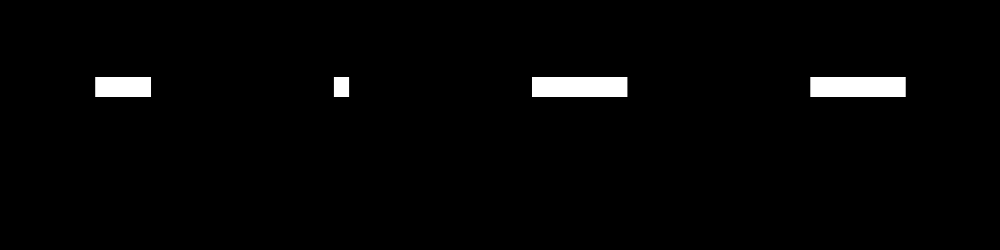
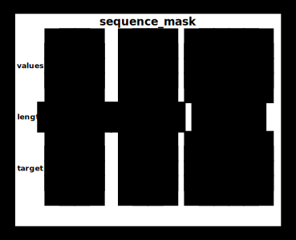
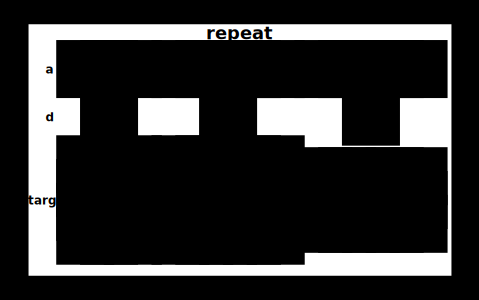

# tinygrad Tensor Puzzles

> This fork is an adaptation of [Sasha's Tensor Puzzles](https://github.com/srush/Tensor-Puzzles) in tinygrad.

## Motivation

When learning a tensor library like tinygrad or Numpy it
is tempting to rely on the standard library (or more honestly
StackOverflow) to find a magic function for everything. But in
practice, the tensor APIs are extremely expressive, and you can
do most things from first principles and clever use of broadcasting.

This is a collection of 21 tensor puzzles. Like chess puzzles, these are
not meant to simulate the complexity of a real program but to practice
in a simplified environment. Each puzzle asks you to reimplement one
function in tinygrad without magic.

## Video

If you are interested, there is also a YouTube walkthrough of the puzzles by the original author:

[](https://youtu.be/Hafo7hIl8MU)

## Start

To start, install the dependencies using pipenv with `pipenv install` or using pip with `pip install -r requirements.txt`. Then head to `src/puzzles.ipynb` after you have read the Rules and Notes sections below and start coding!

You can inspect and import code from `src/solutions.py` to compare against your own solutions.

## Rules

1. Each puzzle needs to be solved in 1 line (<80 columns) of code
2. You are allowed `@`, arithmetic, comparison, `shape`, any indexing (e.g. `a[:j], a[:, None], a[arange(10)]`), and previous puzzle functions
3. You are _not allowed_ anything else. No `view`, `sum`, `take`, `squeeze`, `tensor`
4. You can start with these two functions:

   ```python
   def arange(i):
       "Use this function to replace a for-loop."
       return Tensor(list(range(i)))
   ```

   ```python
   def where(q, a, b):
       "Use this function to replace an if-statement."
       return q * a + q.logical_not() * b
   ```

## Notes

1. These puzzles are about _broadcasting_. Know this rule. You can learn more about it [here](https://numpy.org/doc/stable/user/basics.broadcasting.html).

   

2. `src/lib.py` provides several utilities that you will find useful throughout the puzzles. Below is an explanation of each.

3. `TinyType` is a small utility type similar to `TensorType` from [TorchTyping](https://github.com/patrick-kidger/torchtyping/tree/master). It is used to specify the shapes and data types of tensors, which is used by `draw_examples` and `make_test` to generate sample data and test your solutions.

   Examples:

   ```py
    from tinygrad import Tensor, dtypes

    a: TT[["i", "j"]] = Tensor([[1, 2], [3, 4]])
    b: TT[["i * j"]] = Tensor([1, 2, 3, 4])
    c: TT[["i"], dtypes.bool] = Tensor([True, False])
    d: TT[["i", 3]] = Tensor([[1, 2, 3], [4, 5, 6]])
    e: TT[[4]] = Tensor([1, 2, 3, 4])
   ```

4. `draw_examples` is a utility function that takes as input a title and a list of objects with common keys each assigned a tensor. Example using `arange`:

   ```py
    from tinygrad import Tensor
    from lib import draw_examples

    def arange(i: int):
       "Use this function to replace a for-loop."
       return Tensor(list(range(i)))

    draw_examples("arange", [{"input": Tensor([i]), "output": arange(i)} for i in [5, 3, 9]])
   ```

   In a Jupyter notebook, the output is displayed as:
   

   By default, diagram cells are colored as: transparent for 0's, orange for positives, and blue for negatives.
   If you would like to display the values instead, pass `display_values=True` to `draw_examples`.
   

5. `make_test` takes a title, solution, spec function, and other configuration arguments, and performs two things: first, it draws an example depicting your solution's output compared to the spec function's output. second, it returns a test function which when executed will test your solution with a set of drawn sample data.

   `make_test` uses a composite [Hypothesis](https://hypothesis.works/) strategy to generate sample data.

   Let's take as an example the `ones` puzzle, which given an integer `i` returns a tensor of size `i` filled with ones. For the sake of demonstration, let's assume the solution is implemented incorrectly, returning a tensor of zeros instead of ones.

   ```py
   def ones_spec(out):
    for i in range(len(out)):
        out[i] = 1


   def ones(i: int) -> TT[["i"]]:
       return arange(i) * 0


   test_ones = make_test("ones", ones, ones_spec, add_sizes=["i"])
   ```

   `make_test` is able to extract type information from `TinyType` and generate conforming tensors, but for integer arguments (to specify things like sizes for example), you have specify the `add_sizes` argument to pass the value as generated in sample data to your solution function.

   Running the example above will display the following diagram:
   

   As you can see, the target as specified by `ones_spec` is all ones, while the solution returns all zeros. So you can use this as a visual aid to compare your solution to the target.

   If you would like to display the values instead, pass `display_values=True` to `make_test`.
   

7. `run_test` runs the function returned by `make_test` and displays a puppy if all tests pass 😃

## Sample Puzzles

### sequence_mask

Compute [sequence_mask](https://www.tensorflow.org/api_docs/python/tf/sequence_mask) - pad out to length per batch.

```py
def sequence_mask_spec(values, length, out):
  for i in range(len(out)):
    for j in range(len(out[0])):
      if j < length[i]:
        out[i][j] = values[i][j]
      else:
        out[i][j] = 0


def sequence_mask(values: TT[["i", "j"]], length: TT[["i"], dtypes.int]) -> TT[["i", "j"]]:
  raise NotImplementedError


def constraint_set_length(d):
  d["length"] = d["length"] % d["values"].shape[1]
  return d


test_sequence = make_test(
  "sequence_mask",
  sequence_mask,
  sequence_mask_spec,
  constraint=constraint_set_length,
  display_values=True,
)
```



### bincount

Compute [repeat](https://docs.tinygrad.org/tensor/movement/?h=repeat#tinygrad.Tensor.repeat)

```python
def repeat_spec(a, d, out):
  for i in range(d[0]):
    for k in range(len(a)):
      out[i][k] = a[k]


def constraint_set(d):
  d["d"][0] = d["return"].shape[0]
  return d


def repeat(a: TT[["i"]], d: TT[[1]]) -> TT[["d", "i"]]:
  raise NotImplementedError


test_repeat = make_test("repeat", repeat, repeat_spec, constraint=constraint_set)
```


